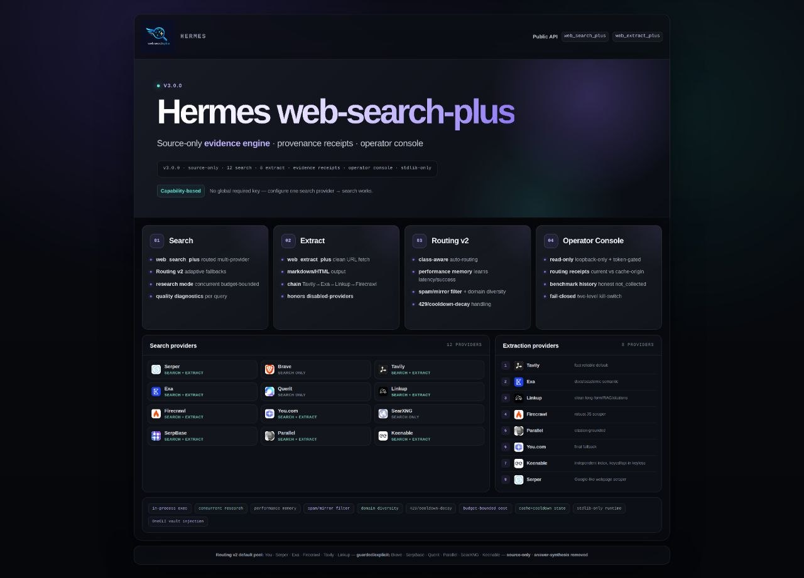

# Web Search Plus — Hermes Plugin

<p align="center">
  
</p>

<p align="center">
  <a href="LICENSE"></a>
  
  
</p>

**Give your Hermes agent better web search and clean page reading.** Web Search Plus connects several search services behind one simple setup. It returns the original links and pages, can try another service when one fails, and works with just one configured provider.

It adds two Hermes tools:

- `web_search_plus` — search the web and return useful sources
- `web_extract_plus` — read and clean the pages you already have

> Ported from [web-search-plus-plugin](https://github.com/robbyczgw-cla/web-search-plus-plugin) for the [Hermes Agent](https://github.com/NousResearch/hermes-agent) plugin API.

Current release: **v3.3.0** — see the [Changelog](CHANGELOG.md) and [3.3 Release Notes](docs/RELEASE_NOTES_V33.md).

### What's new in 3.3

Version 3.3 keeps more useful text when reading pages, combines supporting details more carefully, and can finish broad research sooner when it already has enough good sources. The tools and normal setup stay the same.

For the technical details, see the [3.3 Release Notes](docs/RELEASE_NOTES_V33.md).

---

## Why use it

- **One setup, many search services.** Pick one provider to start and add more only when you need them.
- **Real sources.** Results point back to the pages they came from instead of hiding the web behind a generated answer.
- **Fewer dead ends.** If one service is unavailable or returns nothing, Web Search Plus can try another.
- **Search and page reading together.** Find useful pages, then turn them into clean text for your agent.
- **Optional details when you need them.** Quality reports show which service worked and what happened along the way.
- **Local options are available.** SearXNG, Keenable and the optional Hound connection can reduce your dependence on paid APIs.

Everything new since 3.0 is additive or opt-in; defaults stay stable across upgrades. Full details: [3.3 Release Notes](docs/RELEASE_NOTES_V33.md) · [3.2 Release Notes](docs/RELEASE_NOTES_V32.md) · [3.1 Release Notes](docs/RELEASE_NOTES_V31.md) · [3.0 Release Notes](docs/RELEASE_NOTES_V3.md).

---

## Quick Start

```bash
# 1) Install and enable the plugin
hermes plugins install robbyczgw-cla/hermes-web-search-plus --enable

# 2) Inspect provider readiness and configure the providers you use
python3 ~/.hermes/plugins/web-search-plus/setup.py status
python3 ~/.hermes/plugins/web-search-plus/setup.py setup --preset starter

# 3) Reload Hermes so the tools are registered
# CLI: exit and start `hermes` again, or use /reset in-session
# Gateway: /restart, then /reset

# 4) Optional shell smoke test
cd ~/.hermes/plugins/web-search-plus
python3 search.py --query "Hermes Agent latest release" --provider auto --quality-report
```

Web Search Plus supports 13 search and 9 extraction providers — you do **not** need them all. One search-capable key or configured local endpoint enables `web_search_plus`; one extraction-capable key or endpoint enables `web_extract_plus`; more providers just make controlled routing more flexible. The setup helper stores keys in the active Hermes environment file — never commit them to the repository.

### Upgrading from 2.x? Relax.

Your setup keeps working: the public tools, their names, and your provider keys are unchanged, and updating the plugin is enough — searches and extractions run immediately.

```bash
hermes plugins update web-search-plus
```

Two honest notes:

- **One breaking change (since 3.0):** the Perplexity and Kilo answer endpoints are no longer registered — Web Search Plus is source-only by design. Existing keys are ignored, not deleted.
- **Optional, not required:** `python3 search.py state-migrate` imports your old 2.x routing telemetry (provider health/stats) so adaptive routing keeps its memory. It is dry-run by default, creates a verified backup before `--apply`, and supports rollback. Skipping it loses nothing except that routing re-learns from scratch. Details: [3.0 Migration](docs/V3_MIGRATION.md), then [3.1 Migration](docs/V31_MIGRATION.md) for the opt-in feature matrix.

### Self-hosted / no-paid-key profile

For a privacy- and budget-oriented setup with no commercial API key, use the self-hosted wizard preset:

```bash
python3 ~/.hermes/plugins/web-search-plus/setup.py setup --preset self-hosted
python3 ~/.hermes/plugins/web-search-plus/setup.py status
```

It selects the derived `self_hosted` profile: automatic search uses only your SearXNG instance and keyless Keenable, while automatic extraction runs through Keenable's public fetch tier (SearXNG does not extract; the public tier is rate-limited and has no SLA). Configure SearXNG with `searxng.base_url` (the older `instance_url` still works); the preset enables Keenable's existing public tier without writing a key. See the [Self-hosted profile guide](docs/USER_GUIDE.md#self-hosted-profile) for prerequisites and explicit-provider behavior.

### Local Hound provider

[Hound](https://github.com/dondai1234/master-fetch), created by [Bishesh Bhandari](https://github.com/dondai1234), is an independent MIT-licensed MCP server for local keyless search and browser-backed extraction. WSP 3.3 connects to a separately installed Hound sidecar on loopback; it does not bundle or fork Hound. Hound is explicit-only by default, so installing it does not change automatic routing or fallback.

Keyless means no commercial API key or per-request provider bill — not offline, anonymous, or cost-free. Public engines and target sites still receive requests from your IP, browser mode consumes local resources, and reliability has no hosted-service SLA. See the [Hound provider guide](docs/HOUND.md) for installation, security boundaries, verification, and the full pros/cons.

Update later with:

```bash
hermes plugins update web-search-plus
```

Python 3.10+ is required for the core plugin. The core runtime is standard-library only; the optional Hound bridge uses the MCP SDK and `httpx` supplied by current Hermes runtimes, while Hound itself requires a separate Python 3.11+ installation.

---

## The two tools

### `web_search_plus`

Use it for current information, source discovery, or opt-in multi-provider research.

```python
web_search_plus(query="Hermes Agent latest release")
web_search_plus(query="compare recent open-source agent frameworks", mode="research", quality_report=True)
```

### `web_extract_plus`

Use it when you already have URLs and want clean page content.

```python
web_extract_plus(urls=["https://example.com"])
web_extract_plus(urls=["https://docs.example.com"], provider="linkup", render_js=False)
```

Full parameters, freshness and locale behavior, provider selection, extraction controls, and cache management live in the [User Guide](docs/USER_GUIDE.md).

---

## Documentation

**Where to go next:**

- **Installing or configuring providers** → [User Guide](docs/USER_GUIDE.md) · [Hound local provider](docs/HOUND.md)
- **Upgrading from 2.x** → [3.0 Migration](docs/V3_MIGRATION.md), then [3.1 Migration](docs/V31_MIGRATION.md)
- **What changed** → [Changelog](CHANGELOG.md) · [3.3 Release Notes](docs/RELEASE_NOTES_V33.md)
- **Troubleshooting** → [FAQ](docs/FAQ.md) · [Operator Console](docs/V3_OPERATOR_CONSOLE.md)
- **Contributing or building a provider** → [Contributing](CONTRIBUTING.md) · [Provider SDK](docs/PROVIDER_SDK.md) · [Architecture](docs/ARCHITECTURE.md)

The full reference, including the normative v3 contracts for implementers and reviewers:

### Start & upgrade

- [User Guide](docs/USER_GUIDE.md) — installation, first-run checks, tool usage, and troubleshooting
- [3.3 Release Notes](docs/RELEASE_NOTES_V33.md) — heading-aware spans, provenance enrichment, Research quorum, compatibility, and attribution
- [3.2 Release Notes](docs/RELEASE_NOTES_V32.md) — local Hound integration, keyless trade-offs, compatibility, and attribution
- [Hound local provider](docs/HOUND.md) — separate installation, loopback service, verification, privacy, and operating costs
- [3.1 Release Notes](docs/RELEASE_NOTES_V31.md) — 3.1 highlights and compatibility
- [3.1 Migration](docs/V31_MIGRATION.md) — opt-in matrix, kill switches, verification, and rollback
- [Provider SDK](docs/PROVIDER_SDK.md) — add a provider with one `providers.d` module
- [3.0 Release Notes](docs/RELEASE_NOTES_V3.md) — highlights, provider changes, compatibility, and 3.1 deferrals
- [3.0 Migration](docs/V3_MIGRATION.md) — dry run, apply, smoke tests, and rollback
- [3.0 Compatibility](docs/V3_COMPATIBILITY.md) and [Backup & Restore](docs/V3_BACKUP_RESTORE.md) — stable surfaces and recovery behavior

### Configure & operate

- [Provider Reference](docs/PROVIDERS.md) — generated capabilities, environment variables, defaults, and signup links
- [Routing v2 Reference](docs/ROUTING.md) — generated routing classes, preferences, and demotions
- [Operator Console](docs/V3_OPERATOR_CONSOLE.md) — local read-only visibility and troubleshooting
- [Provider Benchmarks](docs/V3_BENCHMARKS.md) — search and extraction comparison with privacy and quota guidance
- [FAQ](docs/FAQ.md) — provider selection, cache, cost, and common setup problems

### Deep reference

- [Architecture](docs/ARCHITECTURE.md) — plugin boundaries, routing, cache/state flow, and provider extensions
- [3.0 Wire Contract](docs/V3_WIRE_CONTRACT.md) — normative request and response surface
- [Source Evidence](docs/V3_SOURCE_EVIDENCE_CONTRACT.md), [Bounded Context](docs/V3_BOUNDED_CONTEXT_CONTRACT.md), and [Search Parity](docs/V3_SEARCH_PARITY_CONTRACT.md) — detailed v3 contract amendments

---

## Development

```bash
cd ~/.hermes/plugins/web-search-plus
python3 -m pip install -r requirements.txt
python3 -m pytest -q
python3 -m compileall -q __init__.py search.py setup.py scripts tests
```

Generated provider and routing references are checked in CI. Start with [Contributing](CONTRIBUTING.md); development architecture and extension notes are in [Architecture](docs/ARCHITECTURE.md).

---

## License

MIT — see [LICENSE](LICENSE).

## Related

- [web-search-plus-plugin](https://github.com/robbyczgw-cla/web-search-plus-plugin) — TypeScript/OpenClaw version
- [Hermes Agent](https://github.com/NousResearch/hermes-agent) — the agent runtime this plugin extends
- [Hound](https://github.com/dondai1234/master-fetch) — independent MIT-licensed local web-research MCP server by [Bishesh Bhandari](https://github.com/dondai1234); WSP integrates through a separate loopback sidecar
