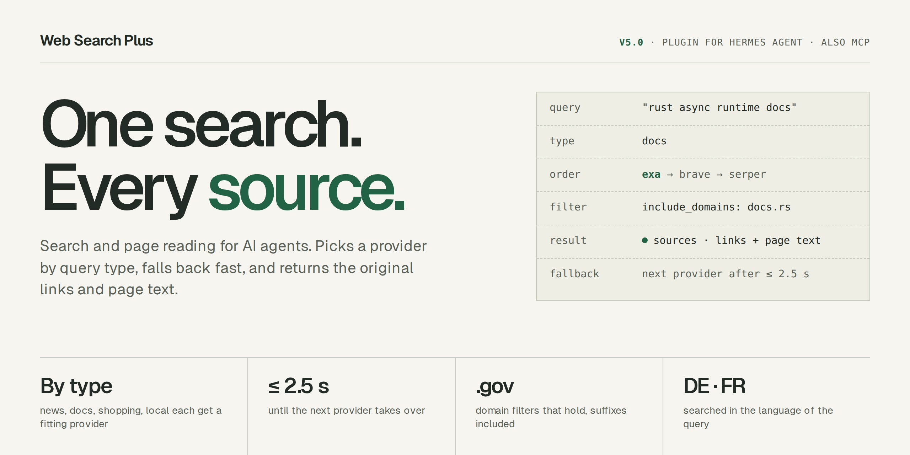

# Web Search Plus — Hermes Plugin

<p align="center">
  
</p>

<p align="center">
  <a href="LICENSE"></a>
  
  
</p>

**Give your Hermes agent better web search and clean page reading.** Web Search Plus connects several search services behind one simple setup. It returns the original links and pages, can try another service when one fails, and works with just one configured provider.

It adds two Hermes tools:

- `web_search_plus` — search the web and return useful sources
- `web_extract_plus` — read and clean the pages you already have

> Ported from [web-search-plus-plugin](https://github.com/robbyczgw-cla/web-search-plus-plugin) for the [Hermes Agent](https://github.com/NousResearch/hermes-agent) plugin API.

Current release: **v5.0.0**. Version history: [Changelog](CHANGELOG.md).

### What's new in 5.0

- **Faster.** Measured on 294 live queries, the median search takes 565 ms instead of 930 ms, and the slowest one 2.1 s instead of 22 s. When a provider hangs or answers empty, the next one starts after at most 2.5 s.
- **Better results.** Two blind judges compared 4.3.5 and 5.0 answer by answer and preferred 5.0 in about two thirds of the queries, in all eight query types.
- **Shorter answers.** Results are about 35 % shorter for the agent; the source a query asks for is found as often as before.
- **Searches in the query's language.** A clearly German or French query is searched in German or French, unless you set a language yourself.
- **Simpler setup.** `setup.py setup` asks for the four providers automatic routing uses most: Brave, Serper, Exa and Linkup. Without a key, it asks (in a terminal, default no) whether to start on Keenable's free public tier so search works right away.

5.0 changes how automatic routing chooses providers: with a Brave key, most searches now go to Brave. Code that imports engine modules directly has to change its imports. Prefer your own order? `setup.py config set-order exa,serper,brave` uses it for every query. Details: [Breaking changes in 5.0](CHANGELOG.md#breaking-changes).

---

## Why use it

- **One setup, many search services.** Pick one provider to start and add more only when you need them.
- **Real sources.** Results point back to the pages they came from instead of hiding the web behind a generated answer.
- **Fewer dead ends.** If one service is unavailable or returns nothing, Web Search Plus tries another.
- **Search and page reading together.** Find useful pages, then turn them into clean text for your agent.
- **Optional details when you need them.** Quality reports show which service answered and why.
- **Local options.** SearXNG, Keenable and the optional DonSeTch provider reduce your dependence on paid APIs.

---

## Quick Start

```bash
# 1) Install and enable the plugin
hermes plugins install robbyczgw-cla/hermes-web-search-plus --enable

# 2) Add provider keys (asks for Brave, Serper, Exa and Linkup; Enter skips one)
python3 ~/.hermes/plugins/web-search-plus/setup.py setup
python3 ~/.hermes/plugins/web-search-plus/setup.py status

# 3) Reload Hermes so the tools are registered
# CLI: exit and start `hermes` again, or use /reset in-session
# Gateway: /restart, then /reset

# 4) Optional shell smoke test
cd ~/.hermes/plugins/web-search-plus
python3 search.py --query "Hermes Agent latest release" --provider auto --quality-report
```

Web Search Plus supports 15 search and 9 extraction providers; you do **not** need them all. One search key enables `web_search_plus`, one extraction key enables `web_extract_plus`. Automatic routing tries Brave first for most queries, Exa for docs and academic queries, and Serper for security and shopping; `setup.py status` shows which query types fall back because a key is missing. `setup.py setup --preset all` walks through every provider. The setup helper stores keys in the active Hermes environment file — never commit them to the repository.

Optional Jev stays off unless you pass `--jev`:

```bash
python3 ~/.hermes/plugins/web-search-plus/setup.py setup --preset lean \
  --jev --jev-key-file "$HOME/.hermes/secrets/typesafe_api_key"
```

Provider privacy is not uniform. Before sending sensitive queries or URLs, review the maintained [Provider Privacy & Terms guide](https://websearchplus.xyz/providers.html#privacy-terms), which distinguishes standard self-serve terms from enterprise-only ZDR or no-training options.

### Self-hosted / no-paid-key profile

For a privacy- and budget-oriented setup with no commercial API key, use the self-hosted wizard preset:

```bash
python3 ~/.hermes/plugins/web-search-plus/setup.py setup --preset self-hosted
python3 ~/.hermes/plugins/web-search-plus/setup.py status
```

It selects the derived `self_hosted` profile: automatic search uses only your SearXNG instance and keyless Keenable, while automatic extraction runs through Keenable's public fetch tier (SearXNG does not extract; the public tier is rate-limited and has no SLA). Configure SearXNG with `searxng.base_url` (the older `instance_url` still works); an instance on localhost or your LAN also needs `SEARXNG_ALLOW_PRIVATE=1` in `.env`; the preset enables Keenable's existing public tier without writing a key. See the [Self-hosted profile guide](docs/USER_GUIDE.md#self-hosted-automatic-routing-profile) for prerequisites and explicit-provider behavior.

### Optional Octen source search via Monid

Set `MONID_API_KEY` from [Monid](https://app.monid.ai/access/api-keys) to use [Octen](https://octen.ai) as an explicit source-search provider:

```python
web_search_plus(query="recent vector database research", provider="octen", freshness="month")
```

The adapter executes Octen's `/search` endpoint through Monid's documented HTTP API for ranked links and highlights. It supports freshness and domain filters, explicitly disables full-content retrieval, and does not call Octen's answer or Broad Search APIs. Access and billing use Monid's prepaid wallet; see Monid for current pricing and terms. Octen stays outside automatic routing and fallback unless you deliberately enable `auto_allow`.

### Optional TinyFish source search

Set `TINYFISH_API_KEY` from your own [TinyFish account](https://agent.tinyfish.ai/api-keys) to use its direct Search API explicitly. Web Search Plus does not provide, pool, proxy, or share TinyFish credentials.

```python
web_search_plus(query="recent agent framework releases", provider="tinyfish", freshness="week")
```

The adapter calls only TinyFish's fixed source-search endpoint and returns ranked links and snippets. It never sends the optional `purpose` or `fetch` parameters and does not call TinyFish Agent or Browser APIs. Domain filters and result hosts are accepted only as ASCII/Punycode hostnames; raw Unicode hostnames are rejected fail-closed. TinyFish remains outside automatic routing and fallback: its [standard Terms](https://www.tinyfish.ai/terms) permit Customer Data to be used for model training and fine-tuning, and its [Privacy Policy](https://www.tinyfish.ai/privacy-policy) does not provide a fixed deletion period. Treat the integration as high risk unless your contract supplies stronger terms; see the [provider/privacy matrix](https://websearchplus.xyz/providers.html#privacy-terms).

### Local DonSeTch provider

[DonSeTch](https://github.com/dondai44423/donsetch) is an independent AGPL-3.0-only local MCP program for source search, fetching, crawling, and PDF-oriented retrieval. WSP 4.0 connects to a separately installed DonSeTch executable through stdio; it does not bundle or redistribute DonSeTch. DonSeTch is explicit-only by default, so installing it does not change automatic routing or fallback.

Set `DONSETCH_BIN` to the absolute executable path and see the [DonSeTch provider guide](docs/DONSETCH.md) for installation, migration, security boundaries, verification, and limitations.

Update later with:

```bash
hermes plugins update web-search-plus
```

Python 3.10+ is required for the core plugin. The optional DonSeTch bridge uses the separately installed executable and does not add DonSeTch or its AGPL-3.0-only dependencies to the plugin package.

---

## The two tools

### `web_search_plus`

Use it for current information, source discovery, or opt-in multi-provider research.

```python
web_search_plus(query="Hermes Agent latest release")
web_search_plus(query="compare recent open-source agent frameworks", mode="research", quality_report=True)
```

### `web_extract_plus`

Use it when you already have URLs and want clean page content.

```python
web_extract_plus(urls=["https://example.com"])
web_extract_plus(urls=["https://docs.example.com"], provider="linkup", render_js=False)
```

Full parameters, freshness and locale behavior, provider selection, extraction controls, and cache management live in the [User Guide](docs/USER_GUIDE.md).

---

## Documentation

**Where to go next:**

- **Installing or configuring providers** → [User Guide](docs/USER_GUIDE.md) · [DonSeTch local provider](docs/DONSETCH.md)
- **Comparing provider privacy and terms** → [Provider Privacy & Terms](https://websearchplus.xyz/providers.html#privacy-terms)
- **Upgrading** → [Breaking changes in 5.0](CHANGELOG.md#breaking-changes) · [DonSeTch migration from 4.0](docs/DONSETCH.md#migration-from-hound)
- **What changed** → [Changelog](CHANGELOG.md)
- **Troubleshooting** → [FAQ](docs/FAQ.md) · [Operator Console](docs/V3_OPERATOR_CONSOLE.md)
- **Contributing or building a provider** → [Contributing](CONTRIBUTING.md) · [Provider SDK](docs/PROVIDER_SDK.md) · [Architecture](docs/ARCHITECTURE.md)

The full reference, including the normative v3 contracts for implementers and reviewers:

### Start & upgrade

- [User Guide](docs/USER_GUIDE.md) — installation, first-run checks, tool usage, and troubleshooting
- [Changelog](CHANGELOG.md) — every release; older release notes are linked from there
- [DonSeTch local provider](docs/DONSETCH.md) — separate installation, stdio configuration, migration, and operating boundaries
- [Provider SDK](docs/PROVIDER_SDK.md) — add a provider with one `providers.d` module

### Configure & operate

- [Provider Reference](docs/PROVIDERS.md) — generated capabilities, environment variables, defaults, and signup links
- [Provider Privacy & Terms](https://websearchplus.xyz/providers.html#privacy-terms) — provider-specific training, retention, ZDR, and contract caveats
- [Routing Reference](docs/ROUTING.md) — generated: how the first provider is chosen per query type
- [Operator Console](docs/V3_OPERATOR_CONSOLE.md) — local read-only visibility and troubleshooting
- [Provider Benchmarks](docs/V3_BENCHMARKS.md) — search and extraction comparison with privacy and quota guidance
- [FAQ](docs/FAQ.md) — provider selection, cache, cost, and common setup problems

### Deep reference

- [Architecture](docs/ARCHITECTURE.md) — plugin boundaries, routing, cache/state flow, and provider extensions
- [3.0 Wire Contract](docs/V3_WIRE_CONTRACT.md) — normative request and response surface
- [Source Evidence](docs/V3_SOURCE_EVIDENCE_CONTRACT.md), [Bounded Context](docs/V3_BOUNDED_CONTEXT_CONTRACT.md), and [Search Parity](docs/V3_SEARCH_PARITY_CONTRACT.md) — detailed v3 contract amendments

---

## Development

```bash
cd ~/.hermes/plugins/web-search-plus
python3 -m pip install -r requirements.txt
python3 -m pytest -q
python3 -m compileall -q __init__.py search.py setup.py scripts tests
```

Generated provider and routing references are checked in CI. Start with [Contributing](CONTRIBUTING.md); development architecture and extension notes are in [Architecture](docs/ARCHITECTURE.md).

---

## License

MIT — see [LICENSE](LICENSE).

## Related

- [web-search-plus-plugin](https://github.com/robbyczgw-cla/web-search-plus-plugin) — TypeScript/OpenClaw version
- [Hermes Agent](https://github.com/NousResearch/hermes-agent) — the agent runtime this plugin extends
- [DonSeTch](https://github.com/dondai44423/donsetch) — independent AGPL-3.0-only local web-research MCP program; WSP integrates through a separate stdio process
